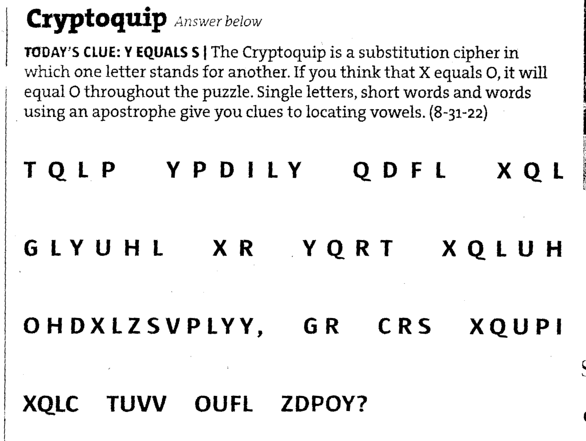

# Cryptoquip Solver

King Features has a daily cipher puzzle
called [Cryptoquip](https://weekly.kingfeatures.com/?team=games-and-puzzles)
that might run in your newspaper.

People like this sort of thing enough that [books full](https://www.amazon.com/cryptoquip/s?k=cryptoquip)
of Cryptoquips exist.

The Cecil Whig newspaper seems to have a good [online archive of recent cryptoquips](https://www.cecildaily.com/diversions/cryptoquip/).
I find this strange.

There are several other solvers available that may suit your needs better.

https://www.quipqiup.com

https://rumkin.com/tools/cipher/cryptogram-solver/

## Method of Solving

Cryptoquips are plain alphabetic replacement ciphers.
They're not quite as simple as a [Caesar cipher](https://en.wikipedia.org/wiki/Caesar_cipher)
in that if cipher letter A corresponds to clear text letter M,
a Cryptoquip's cipher letter B doesn't necessarily correspond to clear text letter N.
It's not just a rotation of the clear alphabet relative to the cipher alphabet.

The usual method of breaking these kinds of ciphers has you
[frequency analysis](https://www2.rivier.edu/faculty/vriabov/cs572aweb/Assignments/CrackingClassicCiphers.htm):
counting frequencies of cipher letters, and matching high-frequency-of-appearance cipher letters
to high-frequency-of-appearance letters in plain text.
There's not enough text in any day's Cryptoquip to allow frequency analysis to work.
Besides that, getting [frequency analysis](https://github.com/bediger4000/vigenere-ciphering-deciphering)
correct is bug-prone for some reason.
If you wanted to do successful frequency analysis on Cryptoquips,
you'd probably have to consider frequencies of bigrams
as well as single letters,
and also frequency of common short words.
It would be a hassle.
